Investigating diarrhea in NSG mice using metagenomics
================
Bryan Merrill
2022-08-01

# Overview

## Project overview

Immunodeficient mice are important model organisms in diverse areas of
research, including cancer, inflammation, autoimmunity, transplantation,
and virology. Despite extreme immune deficits, these mice remain healthy
while colonized by a gut microbiota that is “specific pathogen free”
(SPF). Care must be taken to isolate these mice from infection prior to
experimentation, as disease outbreaks are both costly and
time-consuming. Here, we used a controlled infection experiment with
strain-resolved shotgun metagenomics to identify the full genome
sequences of two microbes consistent with a diarrhea outbreak in
immunodeficient NSG mice at Stanford University. Follow-up infection and
culturing experiments will confirm whether these microbes play a
causative role.

## Experiment design

We designed two main experiments to identify microbes associated with
the diarrhea outbreak in the Stanford mouse facility. We gathered
material from Stanford-reared NSG mice with symptomatic diarrhea and
exposed (1) NSG mice from JAX via gavage, and (2) NSG mice from Stanford
via co-housing. Both exposure routes led to diarrhea illness and changes
in the gut microbiota. We hypothesized that using strain-resolved
metagenomics on samples gathered during these experiments would a) allow
identification of bacterial strains transmitted from sick to healthy
mice, b) provide genomic insights regarding shared strains that might be
candidate pathogens, and c) suggest methods to identify infected but
pre-symptomatic mice, limiting pathogen spread.

An overview of the experimental design is included below:  
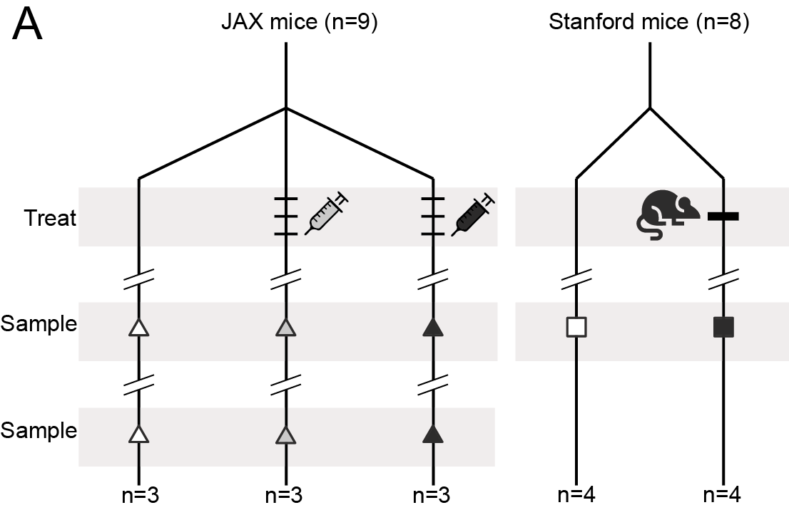

## Code overview

This document analyzes prevalence/abundance information for 26 mouse
samples and 446 bacterial species. These data were gathered into a
phyloseq object as described previously.

# Code

## Reading in files

First, we read in the previously formatted phyloseq object.  
Next, we remove all species that are present in \<=3 samples.

``` r
ps <- readRDS("mouse_diarrhea_phyloseq_coverage.rds")
ps_rel <- ps %>% 
  filter_taxa(function(x){sum(x>0)>3}, prune=T) %>% # removes 58 taxa that are present in <= 3 samples
  transform_sample_counts(function(OTU) OTU/sum(OTU) )
```

Here, we save the sample metadata from the phyloseq object for use as a
supplementary table.

``` r
md_metadata <- sample_data(ps_rel) %>% 
            rownames_to_column("SampleName") %>% data.frame() %>% 
            select(SampleName, everything())

write_tsv(md_metadata, 
          "tables/table_s1_sample_metadata.tsv")
```

## FIGURE 1

Here we generate individual panels to be included in Figure 1.

### 1D: Phylum relative abundance plot

We want to generate a bar plot where samples are grouped by type along
the x-axis, and the relative abundance of each phylum is shown along the
y-axis.

First, we aggregate species-level relative abundance into phylum-level
relative abundance using the `tax_glom` function.

``` r
ps_phylum <- ps_rel %>% 
  tax_glom(taxrank="Phylum")
```

Next, we make a long-formatted table, with one row per sample per
phylum.

``` r
phylum_otudata <- otu_table(ps_phylum) %>% 
  data.frame() %>% 
  rownames_to_column("p") %>% 
  left_join(tax_table(ps_phylum) %>% data.frame() %>% 
              rownames_to_column("p") %>% 
              select("p","Phylum")) %>% 
  select(Phylum, everything(), -p) %>% 
  pivot_longer(2:27, names_to = "SampleName", values_to="rel_abundance") %>% 
  left_join(sample_data(ps_phylum) %>% data.frame() %>% 
              rownames_to_column("SampleName") %>% 
              select(SampleName, index2, Experiment, diarrhea)) %>% 
  arrange(index2, Phylum, Experiment) %>% 
  mutate(index2 = factor(index2, levels=seq(1:26)),
         Phylum = gsub("p__","",Phylum))
```

    ## Joining, by = "p"
    ## Joining, by = "SampleName"

``` r
sample_n(phylum_otudata, 10)
```

    ## # A tibble: 10 × 6
    ##    Phylum            SampleName         rel_abundance index2 Experiment diarrhea
    ##    <chr>             <chr>                      <dbl> <fct>  <fct>      <chr>   
    ##  1 Verrucomicrobiota FC727_control_d25…      0.0588   4      Control 1  no      
    ##  2 Actinobacteriota  FC727_control_d1_…      0.000917 3      Control 1  no      
    ##  3 Patescibacteria   FC732_unfiltered_…      0.00272  13     Unfiltere… yes     
    ##  4 Patescibacteria   F407_control_L1_F…      0.0916   19     Control 2  no      
    ##  5 Cyanobacteria     FC733_unfiltered_…      0.00585  15     Unfiltere… yes     
    ##  6 Firmicutes_A      MC729_filtered_d1…      0.188    11     Filtered … no      
    ##  7 Bacteroidota      FC726_control_d25…      0.466    2      Control 1  no      
    ##  8 Firmicutes_A      FC726_control_d25…      0.406    2      Control 1  no      
    ##  9 Patescibacteria   FC730_filtered_d1…      0.00671  7      Filtered … no      
    ## 10 Actinobacteriota  FC726_control_d25…      0.000517 2      Control 1  no

Finally, we plot and save the bar graph. Each sample is faceted by by
experiment, with the order (left to right) being:

-   Control (JAX mice)
-   Filtered gavage (JAX mice)
-   Unfiltered gavage (JAX mice)
-   Control (Stanford mice)
-   Co-housed (Stanford mice)

``` r
ggplot(phylum_otudata, aes(x=index2, y=rel_abundance, fill=Phylum)) + geom_bar(stat="identity", color="black") + 
  facet_grid(~Experiment, scales = "free_x") + 
  theme_cowplot() + 
  theme(axis.ticks.x=element_blank(),
        axis.text.x=element_blank(),
        strip.text.x=element_blank(), axis.line.x=element_blank(),  
          axis.line.y=element_blank(), axis.title.x=element_blank()) + 
  ylab("Relative abundance") + 
  scale_y_continuous(n.breaks = 2)
```

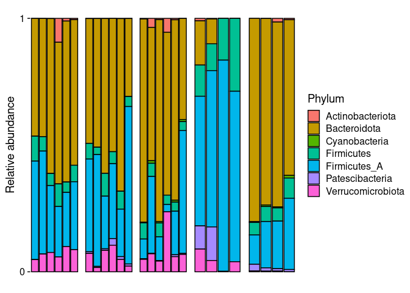<!-- -->

``` r
ggsave("figures/Fig_1D_relAb_by_mouse.pdf")
```

    ## Saving 7 x 5 in image

### Figure 1D statistics

We can also summarize the mean relative abundance of each phylum within
each of the five experimental groups, and make a similar bar graph.

``` r
phylum_otudata_mean <- phylum_otudata %>% 
  summarize.(mean_rel_ab = mean(rel_abundance), .by=c("Phylum","Experiment"))

ggplot(phylum_otudata_mean, aes(x=Experiment, y=mean_rel_ab, fill=Phylum)) + geom_bar(stat="identity", color="black") + 
  facet_grid(~Experiment, scales = "free_x") + 
  theme_cowplot() + 
  theme(axis.ticks.x=element_blank(),
        axis.text.x=element_blank(),
        strip.text.x=element_blank(), axis.line.x=element_blank(),  
          axis.line.y=element_blank(), axis.title.x=element_blank()) + 
  ylab("Relative abundance") + 
  scale_y_continuous(n.breaks = 2)
```

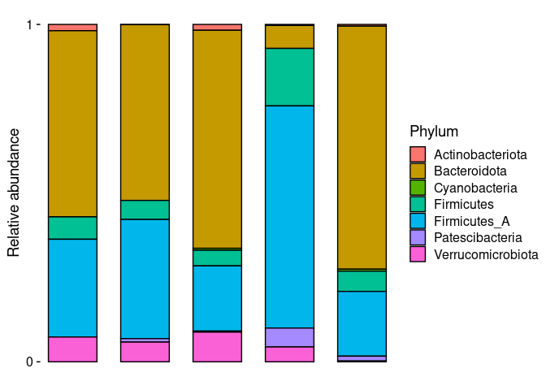<!-- -->

Here, we run a Wilcox test to determine whether the relative abundance
of any phyla vary significantly with regard to diarrhea status (yes/no).
Following p-value adjustment, we see a significant increase in
Bacteroidota and a significant decrease in Firmicutes_A in mice with
diarrhea, compared to those without.

``` r
wilcox_p_phylum <- phylum_otudata %>%
  group_by(Phylum) %>%
  wilcox_test(rel_abundance~diarrhea) %>%
  adjust_pvalue()

wilcox_p_phylum
```

    ## # A tibble: 7 × 9
    ##   Phylum            .y.      group1 group2    n1    n2 statistic       p   p.adj
    ##   <chr>             <chr>    <chr>  <chr>  <int> <int>     <dbl>   <dbl>   <dbl>
    ## 1 Actinobacteriota  rel_abu… no     yes       16    10        55 1.96e-1 5.88e-1
    ## 2 Bacteroidota      rel_abu… no     yes       16    10        20 1.71e-3 1.03e-2
    ## 3 Cyanobacteria     rel_abu… no     yes       16    10         8 9.08e-6 6.36e-5
    ## 4 Firmicutes        rel_abu… no     yes       16    10       115 6.84e-2 2.74e-1
    ## 5 Firmicutes_A      rel_abu… no     yes       16    10       135 2.77e-3 1.38e-2
    ## 6 Patescibacteria   rel_abu… no     yes       16    10        59 2.73e-1 5.88e-1
    ## 7 Verrucomicrobiota rel_abu… no     yes       16    10       105 2.01e-1 5.88e-1

These differences are not significant when using ANOVA, following
p-value adjustment. Instead, we see the very-low-abundance
Patecibacteria and Cyanobacteria vary by diarrhea status.

``` r
anova_p_phylum <- phylum_otudata %>% 
  filter(Experiment != "Control 2") %>%
  group_by(Phylum) %>% 
  anova_test(rel_abundance~Experiment) %>% 
  adjust_pvalue()
```

    ## Coefficient covariances computed by hccm()
    ## Coefficient covariances computed by hccm()
    ## Coefficient covariances computed by hccm()
    ## Coefficient covariances computed by hccm()
    ## Coefficient covariances computed by hccm()
    ## Coefficient covariances computed by hccm()
    ## Coefficient covariances computed by hccm()

``` r
anova_p_phylum
```

    ## # A tibble: 7 × 9
    ##   Phylum            Effect       DFn   DFd     F       p `p<.05`   ges   p.adj
    ##   <chr>             <chr>      <dbl> <dbl> <dbl>   <dbl> <chr>   <dbl>   <dbl>
    ## 1 Actinobacteriota  Experiment     3    18  0.85 0.485   ""      0.124 0.704  
    ## 2 Bacteroidota      Experiment     3    18  2.92 0.062   ""      0.327 0.248  
    ## 3 Cyanobacteria     Experiment     3    18 10.6  0.00031 "*"     0.638 0.00217
    ## 4 Firmicutes        Experiment     3    18  1.16 0.352   ""      0.162 0.704  
    ## 5 Firmicutes_A      Experiment     3    18  1.85 0.175   ""      0.235 0.525  
    ## 6 Patescibacteria   Experiment     3    18  7.41 0.002   "*"     0.553 0.012  
    ## 7 Verrucomicrobiota Experiment     3    18  3.26 0.046   "*"     0.352 0.23

## Supplemental Figure 1

In this figure we plot differences in relative abundance for different
taxonomic levels (S1A) and for species (S1B) by diarrhea status.

### Figure S1A

The first thing we need to do is generate a 3-column table
(`phylum_taxmap`) consisting of a taxonomic rank
(e.g. `g__Bacteroides`), its rank level (e.g. `g`) and its phylum
(e.g. `Bacteroidota`).

``` r
tax_table_out <- tax_table(ps_rel) %>% data.frame() %>% rownames_to_column("genome")

phylum_taxmap <- rbind(tax_table_out %>% select(3) %>% mutate(rank_level="p") %>% 
                         distinct() %>% mutate(tax_rank=Phylum),
                       tax_table_out %>% select(3:4) %>% mutate(rank_level="c") %>% 
                         distinct() %>% dplyr::rename(tax_rank=Class),
                       tax_table_out %>% select(3,5) %>% mutate(rank_level="o") %>% 
                         distinct() %>% dplyr::rename(tax_rank=Order),
                       tax_table_out %>% select(3,6) %>% mutate(rank_level="f") %>% 
                         distinct() %>% dplyr::rename(tax_rank=Family),
                       tax_table_out %>% select(3,7) %>% mutate(rank_level="g") %>% 
                         distinct() %>% dplyr::rename(tax_rank=Genus),
                       tax_table_out %>% select(3,8) %>% mutate(rank_level="s") %>% 
                         distinct() %>% dplyr::rename(tax_rank=Species)) %>% 
  mutate(Phylum=gsub("p__","",Phylum))
```

``` r
sample_n(phylum_taxmap, 10)
```

    ##              Phylum rank_level
    ## 1      Firmicutes_A          s
    ## 2      Firmicutes_A          g
    ## 3      Firmicutes_A          s
    ## 4      Firmicutes_A          c
    ## 5      Firmicutes_A          s
    ## 6  Actinobacteriota          p
    ## 7      Firmicutes_A          s
    ## 8      Firmicutes_A          s
    ## 9      Firmicutes_A          g
    ## 10     Firmicutes_A          g
    ##                                                                                                     tax_rank
    ## 1                                                                                              s__MGBC117744
    ## 2                                                                                           g__Anaerotruncus
    ## 3                                                                                              s__MGBC114113
    ## 4                                                                                            c__Clostridia_A
    ## 5                                                                               s__Lawsonibacter sp009911645
    ## 6                                                                                        p__Actinobacteriota
    ## 7                                                                                              s__MGBC105122
    ## 8  s__METABAT215_SAMESTATE_PRE_SCAFFOLDS_1500_METASPADES__diarrhea_F405_F406_F409_F410_FC732_FC733_MC728.103
    ## 9                                                                                              g__MGBC102897
    ## 10                                                                                                 g__ASF356

Now, we’ll make a long-format table with each row consisting of the
relative abundance of a given species in a given sample, with the full
taxonomic information for that genome as well.

``` r
taxa_abundance_long <- otu_table(ps_rel) %>% data.frame() %>% 
  rownames_to_column("genome") %>% 
  pivot_longer(2:27, names_to="SampleName", values_to="rel_abundance") %>% 
  left_join(tax_table_out)
```

    ## Joining, by = "genome"

``` r
sample_n(taxa_abundance_long, 10)
```

    ## # A tibble: 10 × 10
    ##    genome        SampleName rel_abundance Domain Phylum Class Order Family Genus
    ##    <chr>         <chr>              <dbl> <chr>  <chr>  <chr> <chr> <chr>  <chr>
    ##  1 MGBC101917    F408_cont…     0         d__Ba… p__Fi… c__C… o__O… f__Os… g__M…
    ##  2 MGBC109699    MC728_unf…     0         d__Ba… p__Fi… c__C… o__L… f__La… g__M…
    ##  3 MGBC108016    FC727_con…     0.00104   d__Ba… p__Fi… c__C… o__L… f__La… g__1…
    ##  4 MGBC165261    MC729_fil…     0.0000394 d__Ba… p__Ac… c__C… o__C… f__Eg… g__Z…
    ##  5 MGBC000217    F406_CHD_…     0         d__Ba… p__Ac… c__C… o__C… f__Eg… g__P…
    ##  6 METABAT215_S… F409_CHD_…     0.0000415 d__Ba… p__Fi… c__C… o__T… f__CA… g__M…
    ##  7 MGBC131504    FC732_unf…     0         d__Ba… p__Fi… c__C… o__O… f__Os… g__D…
    ##  8 MGBC110107    F412_cont…     0.000253  d__Ba… p__Ve… c__V… o__V… f__Ak… g__A…
    ##  9 MGBC164609    FC732_unf…     0         d__Ba… p__Fi… c__C… o__O… f__Os… g__C…
    ## 10 MGBC130490    FC731_fil…     0         d__Ba… p__Fi… c__C… o__L… f__La… g__U…
    ## # … with 1 more variable: Species <chr>

We want to run a statistical test comparing the difference in abundance
of a given taxon between healthy and diarrheic mice. We want to do this
at each taxonomic level, from phylum to species. We’ll write a function
that takes as input a taxonomic level and a data frame, and sums the
relative abundance at the specified taxonomic level. Next, we’ll run
that at each level and build a data frame (`taxa_level_summary`) and
summarize that by `diarrhea` status and taxonomic rank (`tax_rank`).

``` r
make_taxa_summ_table <- function(x, df){
  out <- summarize.(df, rel_abundance=sum(rel_abundance), .by=c("SampleName",x)) %>% 
    dplyr::rename(tax_rank=x) %>% 
    mutate(rank_level=x)
  return(out)
}

taxa_level_summary <- rbind(make_taxa_summ_table("Phylum", taxa_abundance_long),
                              make_taxa_summ_table("Class", taxa_abundance_long),
                              make_taxa_summ_table("Order", taxa_abundance_long),
                              make_taxa_summ_table("Family", taxa_abundance_long),
                              make_taxa_summ_table("Genus", taxa_abundance_long),
                              make_taxa_summ_table("Species", taxa_abundance_long)) %>% 
  left_join.(sample_data(ps_rel) %>% data.frame() %>% 
               rownames_to_column("SampleName") %>% 
               select.(SampleName, diarrhea, exp_group, Experiment))
```

    ## Note: Using an external vector in selections is ambiguous.
    ## ℹ Use `all_of(x)` instead of `x` to silence this message.
    ## ℹ See <https://tidyselect.r-lib.org/reference/faq-external-vector.html>.
    ## This message is displayed once per session.

``` r
sample_n(taxa_level_summary, 10)
```

    ## # A tidytable: 10 × 7
    ##    SampleName    tax_rank rel_abundance rank_level diarrhea exp_group Experiment
    ##    <chr>         <chr>            <dbl> <chr>      <chr>        <dbl> <fct>     
    ##  1 FC726_contro… g__CAG-…     0         Genus      no               1 Control 1 
    ##  2 F411_control… s__MGBC…     0.0111    Species    no               2 Control 2 
    ##  3 FC732_unfilt… f__MGBC…     0         Family     yes              1 Unfiltere…
    ##  4 FC730_filter… s__MGBC…     0.000435  Species    no               1 Filtered …
    ##  5 MC728_unfilt… s__UBA3…     0.0000124 Species    yes              1 Unfiltere…
    ##  6 MC729_filter… s__CAG-…     0.0000412 Species    no               1 Filtered …
    ##  7 F412_control… g__UBA7…     0         Genus      no               2 Control 2 
    ##  8 F410_CHD_L2_… s__Adle…     0.0000940 Species    yes              2 Co-housed…
    ##  9 MC720_contro… s__MGBC…     0         Species    no               1 Control 1 
    ## 10 MC720_contro… s__1XD8…     0         Species    no               1 Control 1

First, for each taxonomic level analyzed, we build a table containing
the mean relative abundance by diarrhea status and taxonomic rank. We
then calculate the Wilcox effect size and run the Wilcox test on each
taxonomic rank (phylum to species) by diarrhea status and adjust
p-values for multiple hypothesis testing.

``` r
taxa_level_stats <- taxa_level_summary %>%
  group_by(diarrhea, tax_rank) %>%
  summarize.(mean=mean(rel_abundance), .by=c(diarrhea, tax_rank, rank_level)) %>%
  pivot_wider.(names_from=diarrhea, values_from=mean) %>%
  mutate.(rel_ab_change=(no/yes))

wilcox_effsize <- taxa_level_summary %>% 
  group_by(tax_rank) %>% 
  wilcox_effsize(data=., rel_abundance~diarrhea)

wilcox_test_results <- taxa_level_summary %>% 
  group_by(tax_rank) %>% 
  wilcox_test(data=., rel_abundance~diarrhea) %>% 
  adjust_pvalue() %>% 
  separate.(tax_rank, sep="__", into="rank_level", remove=F) %>% 
  left_join.(taxa_level_summary %>% summarize.(y.position=max(rel_abundance)+0.5*sd(rel_abundance), .by=tax_rank)) %>% 
  left_join.(wilcox_effsize %>% select.(tax_rank, effsize, magnitude)) %>% 
  left_join.(taxa_level_stats %>% select.(tax_rank, no, yes, rel_ab_change)) %>% 
  mutate.(effsize_trans=ifelse(no>yes, -effsize, effsize),
         log.p.adj=-log10(p.adj)) %>% 
  left_join.(phylum_taxmap) %>% 
  mutate(rank_level_full=case_when(
           rank_level == "p" ~ "Phylum",
           rank_level == "c" ~ "Class",
           rank_level == "o" ~ "Order",
           rank_level == "f" ~ "Family",
           rank_level == "g" ~ "Genus",
           rank_level == "s" ~ "Species",
         ),
         rank_level=factor(rank_level, levels=c("p","c","o","f","g","s")),
         rank_level_full=factor(rank_level_full, levels=c("Phylum","Class","Order","Family","Genus","Species"))) %>% 
  arrange(rank_level_full)

write_tsv(wilcox_test_results, "tables/wilcox_test_results.tsv")
```

``` r
sample_n(wilcox_test_results, 10)
```

    ## # A tidytable: 10 × 20
    ##    tax_rank   .y.   group1 group2    n1    n2 statistic       p p.adj rank_level
    ##    <chr>      <chr> <chr>  <chr>  <int> <int>     <dbl>   <dbl> <dbl> <fct>     
    ##  1 g__UMGS10… rel_… no     yes       16    10     146   5.55e-4 0.307 g         
    ##  2 s__MGBC13… rel_… no     yes       16    10     150.  2.24e-4 0.126 s         
    ##  3 s__COE1 s… rel_… no     yes       16    10      88   6.42e-1 1     s         
    ##  4 s__MGBC13… rel_… no     yes       16    10     124   2   e-2 1     s         
    ##  5 s__MGBC13… rel_… no     yes       16    10     134   3.98e-3 1     s         
    ##  6 s__MGBC00… rel_… no     yes       16    10      96.5 2.53e-1 1     s         
    ##  7 s__MGBC10… rel_… no     yes       16    10      52   8.78e-2 1     s         
    ##  8 g__Anaero… rel_… no     yes       16    10     102   2.57e-1 1     g         
    ##  9 o__Achole… rel_… no     yes       16    10     133   5.58e-3 1     o         
    ## 10 s__MGBC12… rel_… no     yes       16    10      76   7.69e-1 1     s         
    ## # … with 10 more variables: y.position <dbl>, effsize <dbl>, magnitude <ord>,
    ## #   no <dbl>, yes <dbl>, rel_ab_change <dbl>, effsize_trans <dbl>,
    ## #   log.p.adj <dbl>, Phylum <chr>, rank_level_full <fct>

Finally, we generate a volcano plot for Figure S1A. Taxa that are
positively associated with diarrhea have a positive effect size, while
taxa that are negatively associated with diarrhea have a negative effect
size.

``` r
volc_plot <- ggplot(wilcox_test_results, aes(x=effsize_trans, y=log.p.adj, color=Phylum)) +
  facet_wrap(~rank_level_full, scales="free_x") + 
  geom_hline(yintercept = -log10(0.05)) + 
  geom_jitter(width=0.2, height=0.2, shape=1, size=2) + 
  ylab("-log10(p.adj)") + xlab("effect size") + 
  # ggtitle("Effect size vs significance for taxonomic ranks") + 
  scale_x_continuous(breaks=c(-1,0,1), limits=c(-1.2,1.2)) + 
  theme_cowplot()
volc_plot
```

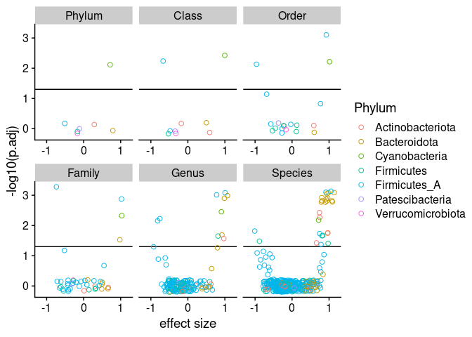<!-- -->

``` r
ggsave("figures/Fig_S1A_volc_plot_all.pdf", plot = volc_plot, width=8, height=5)
```

### Figure S1B

Here, we plot the effect size and -log10(adjusted p-value) for each
species, and facet by phylum.

``` r
species_p <- ggplot(wilcox_test_results %>% filter(rank_level=="s"), aes(x=effsize_trans, y=log.p.adj, label=tax_rank, color=Phylum)) + 
  geom_jitter(width=0.25, height=0.25, shape=1, size=2) + 
  geom_hline(yintercept = 1.30103) + 
  facet_wrap(~Phylum, nrow=2, scales="free_x") + 
  ylab("-log10(p.adj)") + xlab("effect size") + 
  scale_x_continuous(breaks=c(-1,0,1), limits=c(-1.2,1.2)) + 
  theme_cowplot()
  # ggtitle("Effect size vs significance for taxonomic ranks")
species_p
```

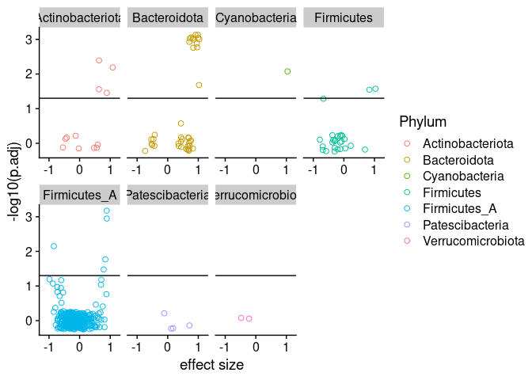<!-- -->

``` r
ggsave("figures/Fig_3_volc_plot_species.pdf", width=10, height=5)
```

We identify the number of species with significant positive associations
with diarrhea and determine which phylum they belong to.

``` r
wilcox_test_results %>% filter(rank_level=="s" & p.adj < 0.05 & effsize_trans>0) %>% 
  pull(Phylum) %>% table()
```

    ## .
    ## Actinobacteriota     Bacteroidota    Cyanobacteria       Firmicutes 
    ##                4               13                1                2 
    ##     Firmicutes_A 
    ##                4

### Comparing two control groups across two major different phyla

Here we want to browse the phylum-level differences in relative
abundance between the two control groups. The mice in each control group
cane from a different vendor and have different underlying microbiota
compositions.

``` r
phy_compare <- taxa_level_summary %>% 
  filter(rank_level=="Phylum" &  !grepl("Cyano",tax_rank)) %>% 
  group_by(tax_rank) %>% 
  wilcox_test(data=., rel_abundance~Experiment)# %>% 
  # adjust_pvalue(method="BH")

phy_compare_eff <- taxa_level_summary %>% 
  filter(rank_level=="Phylum" & grepl("Control",Experiment) & !grepl("Cyano",tax_rank)) %>% 
  group_by(tax_rank) %>% 
  wilcox_effsize(data=., rel_abundance~Experiment)

phy_compare_summary <- taxa_level_summary %>% 
  filter(rank_level=="Phylum" & grepl("Control",Experiment) & !grepl("Cyano",tax_rank)) %>% 
  group_by(tax_rank,Experiment) %>% 
  summarize(mean=mean(rel_abundance))
```

    ## `summarise()` has grouped output by 'tax_rank'. You can override using the
    ## `.groups` argument.

## Figure 1E: NMDS plot

First, we compute the unweighted UniFrac distances between all 26 mouse
samples and then use non-parametric multidimensional scaling to ordinate
the samples in two dimensions.

``` r
u_dist <- distance(ps_rel, method="unifrac")
u_nmds <- ordinate(ps_rel, method="NMDS", distance=u_dist)$points %>% 
  cbind(sample_data(ps_rel)) %>% 
  data.frame() %>% rownames_to_column("SampleName")
```

Next, we generate the scatterplot and save it.

``` r
u_nmds_plot <- ggplot(u_nmds, aes(x=MDS1, y=MDS2, shape=origin_expgroup)) + 
  geom_point(aes(fill=Exposure, size=factor(timepoint)), alpha=0.8) + #size = 3
  scale_shape_manual("Mouse, experiment", 
                     values=c("Jax, gavage"=24, "Stanford, co-house"=22),
                     guide = guide_legend(override.aes = list(size=3))) + 
  scale_fill_manual("Diarrhea exposure", values=c("control"="white","filtered"="gray","unfiltered"="black"), 
                    guide = guide_legend(override.aes = list(shape=(21), fill = c("white","gray","black"), size=3))) + 
  scale_size_manual("Timepoint", values=c("1"=2, "2"=3),
                    guide = guide_legend(override.aes = list(shape=21, fill="white"))) +
  # guides(size="none") +
  geom_line(aes(group=mouse_id), alpha=0.2, size = 0.2) + 
  xlab("NMDS1") + ylab("NMDS2") + 
  scale_x_continuous(breaks=c(seq(-0.4, 0.3, 0.2))) + 
  scale_y_continuous(breaks=c(-0.2,0,0.2), limits = c(-0.25,0.2)) + 
  coord_fixed() + 
  theme_cowplot()
u_nmds_plot
```

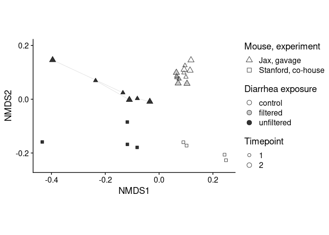<!-- -->

``` r
ggsave("figures/Fig_1_nmds.pdf", plot=u_nmds_plot, height=4)
```

    ## Saving 7 x 4 in image

## Figure 1C: Plotting % reads mapped results

Here we build a dataframe that includes the total reads available for
each sample as well as how many of those reads mapped onto a reference
database alone, or a reference database supplemented with 41 additional
genomes binned from mouse samples in this study.

``` r
read_map_data <- sample_data(ps_rel) %>% data.frame() %>% 
  rownames_to_column("SampleName") %>% 
  select(SampleName, unique_reads, reads_mapped_MGBC, reads_mapped_MGBC_add41) %>% 
  pivot_longer(3:4, names_to="database", values_to="reads_mapped") %>% 
  mutate(perc_reads_mapped=reads_mapped/unique_reads)

read_map_p <- ggplot(read_map_data, aes(x=database, y=perc_reads_mapped)) + 
  geom_boxplot() + 
  # geom_beeswarm(size=1.2) + 
  # facet_wrap(~diarrhea) +
  ylab("Fraction of reads mapped") + 
  # ggtitle("Read recruitment to three reference databases") + 
  geom_signif(comparisons=list(c("reads_mapped_MGBC","reads_mapped_MGBC_add41")),
              step_increase = 0.15) + 
  xlab("Reference database used") + 
  scale_y_continuous(breaks=seq(0,1,0.2), limits=c(0,1.2)) + 
  scale_x_discrete(labels=c("reads_mapped_MGBC"="MGBC", "reads_mapped_MGBC_add41"="MGBC + 41")) + 
  theme_cowplot()
read_map_p
```

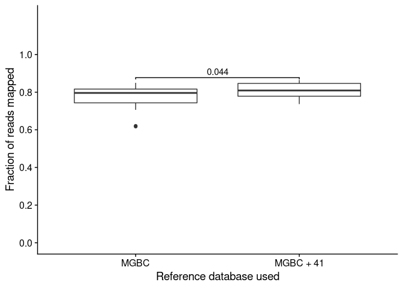<!-- -->

``` r
ggsave("figures/Fig_1_read_recruitment.pdf", plot = read_map_p, width=3, height=5)
```

## Figure 1B: Plotting novel bins

Here, we read in part of the supplementary tables file that contains
metadata for each of the 246 species-level-representative genome bins
identified in the mice from this study and use it to generate a scatter
plot describing the average nucleotide distance (ANI) from the most
similar genome in the MGBC catalog, as well as the quality score
(Completeness - 5\*Contamination)) based on CheckM for that genome bin.

``` r
new_bins_metadata <- read_excel("Supplementary Tables.xlsx", sheet="S3_bins_metadata")
write(new_bins_metadata$`Bin Id`, "tables/bin_id_246.txt")

bin_plot <- ggplot(new_bins_metadata, aes(x=mash_dist, y=score, color=novel)) + 
  geom_point(alpha=1, shape=1, size=3) + 
  ylab("Quality score of genome bin") + xlab("ANI distance from nearest MGBC genome") + 
  # ggtitle("ANI vs quality of 246 bins (medium-quality or better)") + 
  scale_color_manual("Novel", values=c('FALSE'="gray",'TRUE'="black"),
                     labels=c("FALSE"="no", "TRUE"="yes")) + 
  geom_vline(xintercept = 0.05, color="black", linetype="dashed") + 
  theme_cowplot()
bin_plot
```

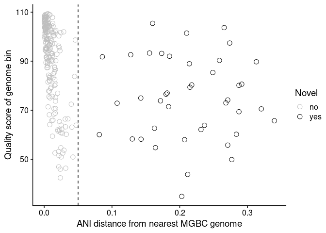<!-- -->

``` r
ggsave("figures/Fig_1_novel_bins.pdf", plot=bin_plot, width=5, height=5)
```

## FIGURE 2

Figure 2 consists of two heatmaps, with 2A containing the number of
strains shared (99.999% ANI over \>10% of the genome) as a fraction of
the species in the sample that had sufficient resolution for profiling
(\>=5x coverage over \>=10% of the genome and \>=25% of the genome
covered by \>=1 read).

To create a matrix of the number of shared species per sample, we first
convert the counts data to presence / absence.

``` r
t <- otu_table(ps) %>% data.frame() %>% 
       rownames_to_column("genome") %>% 
  pivot_longer(2:27, names_to="SampleName", values_to="rel_ab") %>% 
  filter(rel_ab>0)

ps_pres_abs <- ps_rel %>% transform_sample_counts(function(OTU) ifelse(OTU>0,1,0) ) %>% 
  otu_table() %>% as.matrix()
```

Next, we write a function and use it to calculate the number of species
present in each pair of samples, and convert that to a long-formatted
table.

``` r
shared_species <- function(x, y) { 
  set_x <- x[x==1] %>% rownames()
  set_y <- y[y==1] %>% rownames()
  return(as.numeric(length(intersect(set_x, set_y))))
}

shared_dist <- sapply(1:ncol(ps_pres_abs) ,
                      function(y) sapply(1:ncol(ps_pres_abs),
                      function(x) shared_species(ps_pres_abs[,x],ps_pres_abs[,y]))) # WORKED!
rownames(shared_dist) <- colnames(ps_pres_abs)
colnames(shared_dist) <- rownames(shared_dist)

shared_dist_long <- data.frame(shared_dist) %>% 
  rownames_to_column("SampleName") %>% 
  pivot_longer(2:27, names_to="SampleName2", values_to="num_shared_species") %>% 
  arrange(SampleName, SampleName2) %>% 
  distinct()

sample_n(shared_dist_long, 10)
```

    ## # A tibble: 10 × 3
    ##    SampleName                      SampleName2                  num_shared_spec…
    ##    <chr>                           <chr>                                   <dbl>
    ##  1 FC727_control_d25_FF07294019    MC720_control_d25_FF07293981              155
    ##  2 MC728_unfiltered_d1_FF07295645  FC733_unfiltered_d1_FF07295…              164
    ##  3 MC729_filtered_d1_FF07295327    F411_control_L2_FF07295471                 97
    ##  4 F407_control_L1_FF07294457      FC727_control_d25_FF07294019              121
    ##  5 FC732_unfiltered_d25_FF07294217 F407_control_L1_FF07294457                120
    ##  6 FC731_filtered_d1_FF07295373    FC727_control_d1_FF07294201               181
    ##  7 FC726_control_d1_FF07294200     F405_CHD_L1_FF07295352                     29
    ##  8 MC728_unfiltered_d1_FF07295645  F412_control_L2_FF07295548                 96
    ##  9 F412_control_L2_FF07295548      FC733_unfiltered_d1_FF07295…               77
    ## 10 FC732_unfiltered_d1_FF07295682  F410_CHD_L2_FF07295650                     93

We can also create a Jaccard distance matrix in a long-form table.

``` r
jaccard_dist <- distance(ps_rel, method = "jaccard", binary = TRUE)

jaccard_similarity <- 1-as.matrix(jaccard_dist) %>% data.frame()#
jaccard_similarity_long <- jaccard_similarity %>% 
  rownames_to_column("SampleName") %>% 
  pivot_longer(2:27, names_to="SampleName2", values_to="jaccard_similarity") %>% 
  arrange(SampleName, SampleName2)

sample_n(jaccard_similarity_long, 10)
```

    ## # A tibble: 10 × 3
    ##    SampleName                     SampleName2                   jaccard_similar…
    ##    <chr>                          <chr>                                    <dbl>
    ##  1 FC732_unfiltered_d1_FF07295682 FC733_unfiltered_d25_FF07294…            0.370
    ##  2 FC731_filtered_d1_FF07295373   FC727_control_d1_FF07294201              0.815
    ##  3 F411_control_L2_FF07295471     FC730_filtered_d1_FF07295364             0.363
    ##  4 FC727_control_d1_FF07294201    FC730_filtered_d1_FF07295364             0.774
    ##  5 F411_control_L2_FF07295471     F405_CHD_L1_FF07295352                   0.115
    ##  6 FC727_control_d1_FF07294201    FC726_control_d1_FF07294200              0.691
    ##  7 F406_CHD_L1_FF07295376         F409_CHD_L2_FF07295571                   0.579
    ##  8 FC731_filtered_d25_FF07294190  FC733_unfiltered_d1_FF072957…            0.438
    ##  9 MC720_control_d25_FF07293981   F410_CHD_L2_FF07295650                   0.345
    ## 10 FC726_control_d25_FF07294012   FC733_unfiltered_d25_FF07294…            0.165

Now, we want to create a matrix identifying strain-level sharing events
between each pair of samples. First we set the sample order. We then
read in the strain sharing data from the supplementary table and filter
for `popANI >= 0.99999`.

``` r
sample_order <- sample_data(ps_rel) %>% data.frame() %>% rownames_to_column("SampleName") %>% arrange(index2) %>% pull(SampleName)

instrain_genomewide <- read_excel("Supplementary Tables.xlsx", 
                                  sheet="S5_instrain_shared") %>%
  mutate(name1=gsub("__on__MGBC_1094_reps_41_add.sorted.bam","",name1),
         name2=gsub("__on__MGBC_1094_reps_41_add.sorted.bam","",name2)) %>% 
  filter(grepl("FF",name1) & grepl("FF",name2,)) %>% 
  dplyr::rename(SampleName=name1, SampleName2=name2) %>% 
  filter(popANI >= 0.99999)
```

Next, we summarize the table to calculate the number of strains shared
between each pair of samples, and combine that with previous tables that
describe the \# of species shared between samples as well as the Jaccard
distance between those samples.

``` r
shared_strain_count <- instrain_genomewide %>% select(SampleName, SampleName2) %>% 
  # The next line is needed in order to create a symmetrical distance matrix later on
  rbind(data.frame(SampleName=instrain_genomewide$SampleName2, SampleName2=instrain_genomewide$SampleName) %>% filter(SampleName!=SampleName2)) %>% 
  arrange(SampleName, SampleName2) %>% 
  summarize.(shared_strains=n(), .by=c("SampleName","SampleName2"))
sample_n(shared_strain_count, 10)
```

    ## # A tidytable: 10 × 3
    ##    SampleName                      SampleName2                    shared_strains
    ##    <chr>                           <chr>                                   <int>
    ##  1 FC732_unfiltered_d25_FF07294217 FC733_unfiltered_d1_FF07295753              8
    ##  2 FC731_filtered_d1_FF07295373    FC726_control_d25_FF07294012               11
    ##  3 FC732_unfiltered_d1_FF07295682  FC726_control_d25_FF07294012                6
    ##  4 FC732_unfiltered_d1_FF07295682  F406_CHD_L1_FF07295376                      8
    ##  5 F406_CHD_L1_FF07295376          FC732_unfiltered_d1_FF07295682              8
    ##  6 MC720_control_d25_FF07293981    FC730_filtered_d1_FF07295364               17
    ##  7 F412_control_L2_FF07295548      F407_control_L1_FF07294457                  5
    ##  8 FC732_unfiltered_d1_FF07295682  F409_CHD_L2_FF07295571                      8
    ##  9 FC727_control_d25_FF07294019    MC720_control_d1_FF07293949                11
    ## 10 MC728_unfiltered_d25_FF07294210 MC720_control_d25_FF07293981               10

``` r
strains_combined <- shared_dist_long %>% 
  left_join(shared_strain_count) %>% 
  mutate.(shared_strains = ifelse(is.na(shared_strains),0,shared_strains),
          perc_strains_shared_of_max = shared_strains / max(shared_strains), 
          perc_strains_diff_of_max = 1 - perc_strains_shared_of_max, 
          # SampleName=factor(SampleName, levels=sample_order),
          # SampleName2=factor(SampleName2, levels=sample_order),
          .by=SampleName) %>% 
  left_join(jaccard_similarity_long) %>% 
  mutate(SampleName=factor(SampleName, levels=sample_order),
         SampleName2=factor(SampleName2, levels=sample_order),
         perc_strains_shared_of_max=ifelse(perc_strains_shared_of_max==0,NA,perc_strains_shared_of_max),
         ) %>% 
  arrange(SampleName, SampleName2)
```

    ## Joining, by = c("SampleName", "SampleName2")
    ## Joining, by = c("SampleName", "SampleName2")

``` r
sample_n(strains_combined, 10)
```

    ## # A tidytable: 10 × 7
    ##    SampleName       SampleName2 num_shared_spec… shared_strains perc_strains_sh…
    ##    <fct>            <fct>                  <dbl>          <int>            <dbl>
    ##  1 FC732_unfiltere… MC729_filt…               73              5            0.179
    ##  2 F410_CHD_L2_FF0… MC728_unfi…              196              6            0.171
    ##  3 MC728_unfiltere… MC728_unfi…              216             33            1    
    ##  4 F408_control_L1… FC726_cont…              113              0           NA    
    ##  5 FC732_unfiltere… F407_contr…              120              0           NA    
    ##  6 MC729_filtered_… FC733_unfi…              128              5            0.192
    ##  7 FC731_filtered_… MC728_unfi…              138              4            0.182
    ##  8 FC730_filtered_… F410_CHD_L…              133              0           NA    
    ##  9 MC728_unfiltere… FC733_unfi…               78             11            0.333
    ## 10 FC727_control_d… FC727_cont…              161             15            0.625
    ## # … with 2 more variables: perc_strains_diff_of_max <dbl>,
    ## #   jaccard_similarity <dbl>

We convert the long-form `strains_combined` table into a distance
matrix.

``` r
shared_strains_dist <- strains_combined %>% 
  select(SampleName, SampleName2, perc_strains_shared_of_max) %>% 
  pivot_wider(names_from=SampleName2, values_from=perc_strains_shared_of_max) %>% 
  column_to_rownames("SampleName")
```

Now we run some summary-level stats on the \# of shared species
(genomes) and strains shared between a sample and itself. This helps
understand the maximum performance we can expect to see using this
method. On average, we see \~193 species in a given sample (+- 44) and
of those, we can perform strain profiling on \~24 (+-7).

``` r
strains_vs_genomes_shared <- strains_combined %>% 
  filter(SampleName==SampleName2)

strains_vs_genomes_shared %>% 
  summarize(shared_species_mean=mean(num_shared_species),
             shared_species_sd=sd(num_shared_species),
             shared_strains_mean=mean(shared_strains),
             shared_strains_sd=sd(shared_strains),
             )
```

    ##   shared_species_mean shared_species_sd shared_strains_mean shared_strains_sd
    ## 1            193.1538           44.2047            24.53846          6.807236

Now, we bring in the sample metadata to the `strains_combined` table and
remove all same-sample comparisons before we run the same summary as
above. On average, without same-sample comparisons, we see \~117 species
shared between samples (+- 43) but only \~6 strains shared (+- 6)
between samples. This is likely because mice in different experiments
(and thus have different underlying microbiomes) share very few strains.

``` r
strains_shared_summary <- strains_combined %>% 
  left_join.(md_metadata %>% select(SampleName, Experiment)) %>% 
  left_join.(md_metadata %>% select(SampleName, Experiment) %>% 
               rename.(SampleName2=SampleName, Experiment2=Experiment))

strains_shared_summary %>% 
  filter(SampleName!=SampleName2) %>% 
  summarize(shared_species_mean=mean(num_shared_species),
             shared_species_sd=sd(num_shared_species),
             shared_strains_mean=mean(shared_strains),
             shared_strains_sd=sd(shared_strains),
             )
```

    ##   shared_species_mean shared_species_sd shared_strains_mean shared_strains_sd
    ## 1            117.1169          43.08559            5.864615          6.049117

We can also summarize \# of shared spcies and shared strains (on
average) but only run non-self and same-experiment comparisons. The mean
strains shared jumps up because mice in the same experiment originated
with similar microbiomes.

``` r
strains_shared_summary %>% 
  filter(SampleName!=SampleName2 & Experiment==Experiment2) %>% 
  summarize(shared_species_mean=mean(num_shared_species),
             shared_species_sd=sd(num_shared_species),
             shared_strains_mean=mean(shared_strains),
             shared_strains_sd=sd(shared_strains),
             )
```

    ##   shared_species_mean shared_species_sd shared_strains_mean shared_strains_sd
    ## 1            147.4035          37.14257            13.47368          4.960393

### Figure 2A:

Now, we want to make a heatmap of 26 samples x 26 samples where each
block is colored as a percentage calculated by:  
`1 - shared_strains / max(shared_strains)`  
where `max(shared_strains)` represents the \# of strains with sufficient
resolution for profiling as calculated by detecting the \# of
strain-sharing events between a sample and itself.

Making a test heatmap:

``` r
ggplot(strains_combined, aes(x=SampleName, y=reorder(SampleName2, desc(SampleName2)))) + 
  geom_tile(aes(fill=perc_strains_diff_of_max)) + 
  xlab("SampleName") + ylab("SampleName") + 
  coord_fixed() + 
  theme(axis.text.x=element_blank(),axis.text.y=element_blank(),)
```

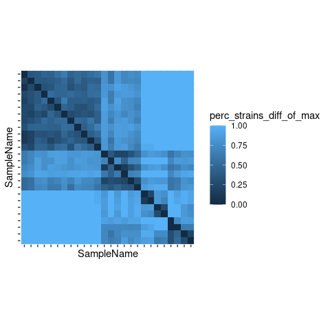<!-- -->

``` r
heatmap_metadata <- sample_data(ps_rel) %>% data.frame() %>% select(Exposure, origin_expgroup) %>% 
  rename("Mouse, experiment"=origin_expgroup)

anno_colors <- list(
  Exposure = c("control"="white","filtered"="gray","unfiltered"="black"),
  `Mouse, experiment` = c("Jax, gavage"="#8c9f19", "Stanford, co-house" = "#9f2c19")
)

pheatmap(mat = as.matrix(shared_strains_dist), 
         # cluster_rows = cluster_samples,
         # cluster_cols = cluster_samples,
         cluster_rows=F, cluster_cols=F, gaps_row=c(6,12,18,22), gaps_col=c(6,12,18,22),
         border_color=NA,
         # cutree_rows = 4,
         # cutree_cols = 4,
         annotation_row = heatmap_metadata, annotation_col = heatmap_metadata,
         show_colnames=F,
         show_rownames=F,
         # treeheight_row = 0,
         # treeheight_col=20,
         annotation_colors = anno_colors,
         color=blues(100),
         # color = colorRampPalette(rev(brewer.pal(n=7,name="YlGnBu")))(100),
         # filename = "figures/Fig_2A_strain_heatmap_unclustered_newcolor.pdf",
         cellwidth = 10,
         cellheight = 10,
         # na_col = "#283A80",
         legend_breaks = seq(0,1,0.2),
         # clustering_dista
)
```

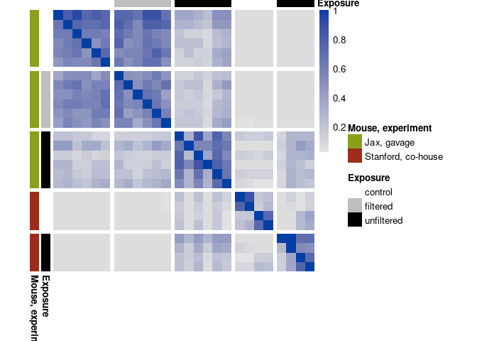<!-- -->

### Figure 2B:

Here we use some deductive reasoning to identify strain-sharing patterns
made possible by exposure to mice with diarrhea through gavage or
co-housing.

First, we get vectors of mice from the Stanford mouse facility that were
controls (`control2`) or co-housed with diarrheic mice (`chd`). We also
get a list of mice from Jax that were gavaged with unfiltered intestinal
homogenate and later developed diarrhea (`chd`).

``` r
control2 <- sample_data(ps_rel) %>% data.frame() %>% filter(Experiment=="Control 2") %>% rownames()
unfiltered <- sample_data(ps_rel) %>% data.frame() %>% filter(Experiment=="Unfiltered stool") %>% rownames()
chd <- sample_data(ps_rel) %>% data.frame() %>% filter(Experiment=="Co-housed w/ diarrhea") %>% rownames()
```

We can identify microbes common to the Stanford mice by looking for
strain-sharing events between the healthy Stanford mice and the sick
Stanford mice. These species can be ruled out as causes of the diarrhea.

``` r
stanford_strains <- instrain_genomewide %>% 
  filter((SampleName %in% control2 & SampleName2 %in% chd) | (SampleName2 %in% control2 & SampleName %in% chd)) %>% 
  pull(genome) %>% sort() %>% unique
```

Since the unfiltered intestinal homogenate was prepared from sick
Stanford mice, we can assume that some non-diarrhea-causing microbes
were included as well as the diarrhea-causing ones. We reason that any
strains found in healthy Stanford mice (`control2`) and sick mice from
Jax that were gavaged (`unfiltered`) are non-causative.

``` r
stanford_strains_in_gavage <- instrain_genomewide %>% 
  filter((SampleName %in% control2 & SampleName2 %in% unfiltered) | (SampleName2 %in% control2 & SampleName %in% unfiltered)) %>% 
  pull(genome) %>% sort() %>% unique()
```

Next, we identify all species shared between mice that got diarrhea from
co-housing (`chd`) or from gavage (`unfiltered`). Any of these could be
causing the diarrhea.

``` r
diarrhea_strains_in_gavage <- instrain_genomewide %>% 
  filter((SampleName %in% chd & SampleName2 %in% unfiltered) | (SampleName2 %in% chd & SampleName %in% unfiltered)) %>% 
  pull(genome) %>% sort() %>% unique()
```

Finally, we group together `stanford_strains_in_gavage` and
`stanford_strains` which can’t be the cause, and subtract them from all
`diarrhea_strains_in_gavage`. This leaves us with 11 species that can’t
be ruled out as being the cause of the diarrhea.

``` r
diarrhea_candidates <- setdiff(diarrhea_strains_in_gavage, union(stanford_strains_in_gavage, stanford_strains))
diarrhea_candidates
```

    ##  [1] "METABAT215_SAMESTATE_PRE_SCAFFOLDS_1500_METASPADES__diarrhea_F405_F406_F409_F410_FC732_FC733_MC728.160"
    ##  [2] "MGBC104261"                                                                                            
    ##  [3] "MGBC105482"                                                                                            
    ##  [4] "MGBC110745"                                                                                            
    ##  [5] "MGBC111863"                                                                                            
    ##  [6] "MGBC116472"                                                                                            
    ##  [7] "MGBC128991"                                                                                            
    ##  [8] "MGBC143807"                                                                                            
    ##  [9] "MGBC151524"                                                                                            
    ## [10] "MGBC163040"                                                                                            
    ## [11] "MGBC165708"

Now we can look at the taxonomy and statistical results for these 11
diarrhea candidates:

``` r
gtdb_df_mod <- read_excel("Supplementary Tables.xlsx", sheet="S4_species_rep_tax") %>% 
  separate.(classification, sep=";", into=c("k","p","c","o","f","g","s")) %>% 
  mutate.(s=ifelse(s=="s__",paste0(s,user_genome),s))

diarrhea_cand_joined <- gtdb_df_mod %>% filter.(user_genome %in% diarrhea_candidates) %>% select(user_genome, s) %>% 
  dplyr::rename(tax_rank=s) %>% 
  left_join.(wilcox_test_results)

diarrhea_cand_joined
```

    ## # A tidytable: 11 × 21
    ##    user_genome        tax_rank .y.   group1 group2    n1    n2 statistic       p
    ##    <chr>              <chr>    <chr> <chr>  <chr>  <int> <int>     <dbl>   <dbl>
    ##  1 MGBC104261         s__MGBC… rel_… no     yes       16    10         0 1.73e-6
    ##  2 MGBC110745         s__Alis… rel_… no     yes       16    10         0 1.73e-6
    ##  3 MGBC111863         s__Alis… rel_… no     yes       16    10         0 1.73e-6
    ##  4 MGBC116472         s__Alis… rel_… no     yes       16    10         0 1.73e-6
    ##  5 MGBC128991         s__CAG-… rel_… no     yes       16    10         0 1.73e-6
    ##  6 MGBC143807         s__MGBC… rel_… no     yes       16    10         0 1.73e-6
    ##  7 MGBC151524         s__Alis… rel_… no     yes       16    10         0 1.73e-6
    ##  8 METABAT215_SAMEST… s__Clos… rel_… no     yes       16    10        16 4.27e-5
    ##  9 MGBC163040         s__CAG-… rel_… no     yes       16    10        16 4.27e-5
    ## 10 MGBC165708         s__CAG-… rel_… no     yes       16    10         0 1.73e-6
    ## 11 MGBC105482         s__Dway… rel_… no     yes       16    10         0 1.73e-6
    ## # … with 12 more variables: p.adj <dbl>, rank_level <fct>, y.position <dbl>,
    ## #   effsize <dbl>, magnitude <ord>, no <dbl>, yes <dbl>, rel_ab_change <dbl>,
    ## #   effsize_trans <dbl>, log.p.adj <dbl>, Phylum <chr>, rank_level_full <fct>

This table reveals that we have 9 species in the Bacteroidota phylum (3
in the Muribaculaceae family, and 6 in the Alistipes genus), and two
species in the Firmicutes_A phylum: Clostridium cuniculi, and
Dwaynesavagella sp. (also known as segmented filamentous bacteria, or
SFB, also known as Candidatus Arthromitus).

Let’s look at the relative abundance of these organsisms across all 26
mice in the study. First we subset the phyloseq object to just the 11
diarrhea candidates. Then, we order the bins so they group by taxonomy,
generate the matrix, and plot it as a heatmap.

``` r
# otu_table(ps_rel)[diarrhea_candidates,] %>% t() %>% View()

ps_rel_diarrhea <- ps %>% 
  filter_taxa(function(x){sum(x>0)>3}, prune=T) %>% 
  transform_sample_counts(function(x) x+1) %>% 
  transform_sample_counts(function(OTU) (OTU/sum(OTU))*100 ) %>%
  subset_taxa(rownames(otu_table(physeq)) %in% diarrhea_candidates) %>% 
  transform_sample_counts(log10) %>% 
  transform_sample_counts(function(OTU) ifelse(OTU<(-3.9),NA,OTU) )

# p <- plot_heatmap(ps_rel_diarrhea)

bin_order <- c("MGBC165708","MGBC163040","MGBC128991","MGBC104261","MGBC151524","MGBC111863","MGBC116472","MGBC110745","MGBC143807","METABAT215_SAMESTATE_PRE_SCAFFOLDS_1500_METASPADES__diarrhea_F405_F406_F409_F410_FC732_FC733_MC728.160","MGBC105482")

diarrhea_otu_matrix <- as.matrix(otu_table(ps_rel_diarrhea))[bin_order,sample_order]

diarrhea_row_md <- tax_table(ps_rel_diarrhea) %>% data.frame() %>% select(Family)
diarrhea_row_labels <- tax_table(ps_rel_diarrhea)[bin_order,"Species"] %>% 
  data.frame() %>% 
  mutate(Species=gsub("s__","",Species)) %>% 
  as.matrix()

# cluster_diarrhea_taxa <- hclust(dist(diarrhea_otu_matrix), method = "average")

pheatmap(mat = diarrhea_otu_matrix,
          cluster_rows=F, gaps_row=c(3,9),
          cluster_cols=F, gaps_col=c(6,12,18,22),
          clustering_distance_rows = "euclidean",
          show_colnames=F,
          show_rownames=T,
          border_color=NA,
          annotation_row = diarrhea_row_md,
          annotation_col = heatmap_metadata,
          # color=blues(100),
          color = colorRampPalette(rev(brewer.pal(n=7,name="YlGnBu")))(100),
          annotation_colors = anno_colors,
          na_col = "#283A80",
          labels_row = diarrhea_row_labels,
         # filename = "figures/Fig_2B_abundance.pdf",
         cellwidth = 10,
         cellheight = 10,
 )
```

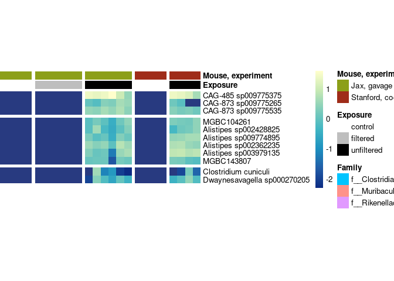<!-- -->

# Other items to investigate:

Sample FC732 had intermittent diarrhea on day 1, severe diarrhea on day
25. Not many things had massive blooms except our two candidate
pathogens.

Add:

-   Phylogenomic tree for clostridia genus
-   Spore forming (presence across tree)
-   Toxin production genes (presence across tree)
-   Genomic context of toxin genes?
-   PCR primers
